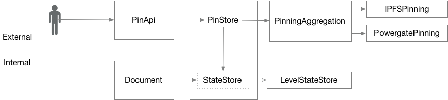

# Pinning Design

## Context and problem statement

We wanted to add additional backend for pinning, namely on Filecoin through Powergate.
Currently, pinning backend is tightly coupled with state store, that tracks full state of a Ceramic document.

We want to:

- have a way to store state in one of the multiple available storages, starting with LevelDB,
- use IPFS pinnning or Filecoin pinning separately or simultaneously,
- select particular pinning backend via runtime configuration.

## Semantics

### Functions

Ceramic node supports storing state of a document and pinning it. While storing state, full state of the document is serialised and stored into a local database. While pinning, all of the document records, as well as dependent ones, like proofs, are pinned.

Storing state is internal operation, i.e. called inside `Document` methods. Pinning a document is requested externally via `PinApi`. When a document is pinned, it has to also be stored in the state store.

If treated as a black box the pinning and state store block exposes following functions:

1. save a document, based on `docId`
   - store latest document state in the state store,
   - pin all the document records.
2. remove a document, based on `docId`
   - unpin the document records,
   - remove stored state in the state store
3. list all pinned documents
   - return list of all the _documents_ pinned based on what is stored in state store
   - _Consideration:_ Both vanilla IPFS and Powergate list all pinned entities, that could represent document records or something else if used on a shared IPFS node
   - based on consideration above, we could not rely on what is reported by IPFS or Powergate
4. indicate if document is pinned
   - return a list of one, if the document is found in state store
5. load a document, based on `docId`
   - read state from the state store
6. save document state to state store directly

### Multiple pinning backends

Having multiple pinning backends simultaneously leads to distributed transactions, if done thoroughly. We have following expectations:

- 90% of the time, only one pinning backend is used,
- pinning is an idempotent operation,
- if multiple pinning backends are used simultaneously, the node _must_ `pin` on all the backends, yet it treats `unpin` operation on best effort basis.

Thus, instead of distributed transactions, we can use light-weight Promises.

## Components

Based on the semantics, it makes sense to have:

1. pure state store - responsible for storing state in a local database,
2. pure pinning backends - responsible for pinning records,
3. pinning backends aggregator - responsible for pinning records using multiple pinning backends simultaneously,
4. pin store aggregator - responsible for storing state and pinning dependent records.



Legend:
- filled arrow - call,
- solid block - class,
- dotted block - interface,
- arrow - interface being implemented by a class,
- external and internal - if the call was initiated outside or intside the node.

Figure above represents all the components working together. External calls through `PinApi` trigger `PinStore` to save state in `StateStore` and pin using `PinningAggregation`. `StateStore` block here represents an interface that is implemented by `LevelStateStore` (persistence on LevelDB). `PinningAggregation` and particular `IPFSPinning` and `PowergatePinning` implement same `Pinning` interface, so one could choose to put a particular pinning backends into `PinStore` instead of aggregation. `PinningAggregation` instantiates pinning backends based on passed connection strings, see below.

One could extend the scheme presented. To add a new pinning backend, one should add one more class implementing `Pinning` interface and add it to a list of available backends. Adding a new state store backend is out of scope. Yet, to achieve this one has to basically mimic Aggregation/Backend pattern used for IPFS. Namely, one could add one more implementation of `StateStore` interface, and provide a state store factory that selects one of the backends based on runtime configuration parameters

## Configuration

### API

We want to achieve common way of configuring different pinning backends, that should work for CLI as command-line parameter, as well as for environment variable. For backends it should contain host-port of the used service endpoint, as well as additional authentication information. Considered YAML/JSON configuration file and URL Connection string. The latter seems to fit the bill without introducing a heavy indirection layer.

Connection string is formed as valid URL, for example:

```
ipfs://localhost:5001
ipfs+https://example.com:3342
powergate+http://example.com:4001
```

Every pinning backend is assigned a unique string that we call _designator_ below. `PinningAggregation` gets a protocol component of connection strings passed, gets the first part of it before an optional plus (`+`) symbol, and treats it as a designator for a backend.
For the examples above, designator searched is `ipfs`. Rest of the connection string is parsed by particular backend.

**IPFS.** Connection string looks like `ipfs://<host>:<port>` or `ipfs+http://<host>:<port>` or `ipfs+https://<host>:<port>`. It is translated into `http://<host>:<port>`, `http://<host>:<port>`, `https://<host>:<port>` correspondingly.

**Powergate.** Powergate requires token for authentication purposes. We pass it as a query param. Connection string looks like `powergate://<host>:<port>?token=<token>`, `powergate+http://<host>:<port>?token=<token>` or `powergate+https://<host>:<port>?token=<token>`. It is translated into `http://<host>:<port>`, `http://<host>:<port>`, `https://<host>:<port>` correspondingly, and set the token passed.

### CLI

For CLI defined in `ceramic-cli` package, we add additional `--pinning` option. It accepts a connection string as defined above. There could be multiple `--pinning` options. They would initialize corresponding number of independent pinning backends.

For example, this would start ceramic daemon with three backends. One is on Powergate, that is Filecoin, another is on operational IPFS node used by Ceramic node, and the third one uses additional IPFS node, for redundancy.

```
$ ceramic daemon --pinning "powergate+http://localhost:6002?token=940a1a4d-ce97-459d-996e-461209e9c863" --pinning "ipfs://__context" --pinning "ipfs+https://remote.cloud.com:5006"
```  